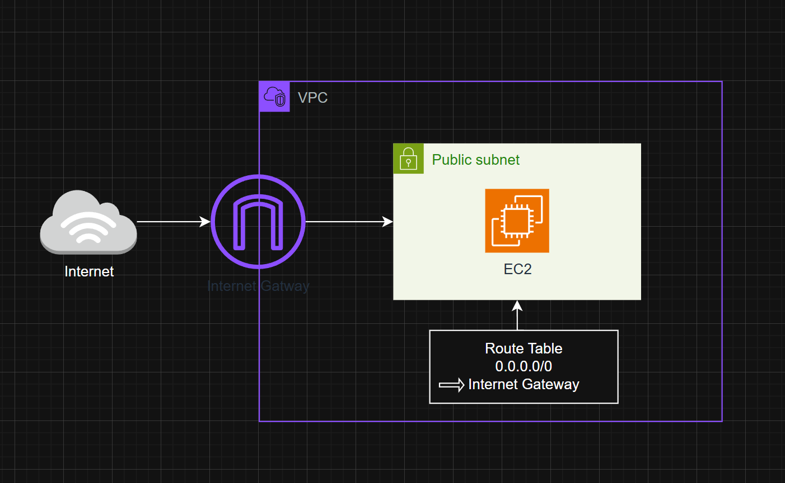

# AWS VPC + Public Subnet + EC2

This project demonstrates how to create a simple AWS VPC with a public subnet and an EC2 instance accessible from the Internet.

## Architecture Diagram

## Steps
Follow the detailed, step-by-step instructions in [steps.md) to build this architecture in your AWS account.
